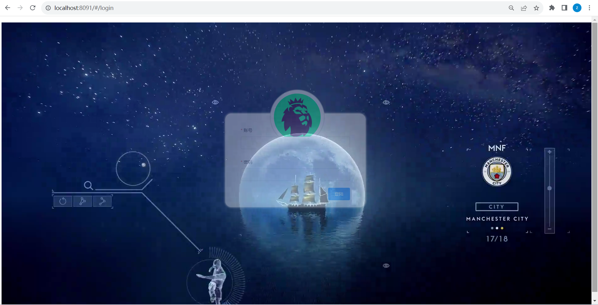
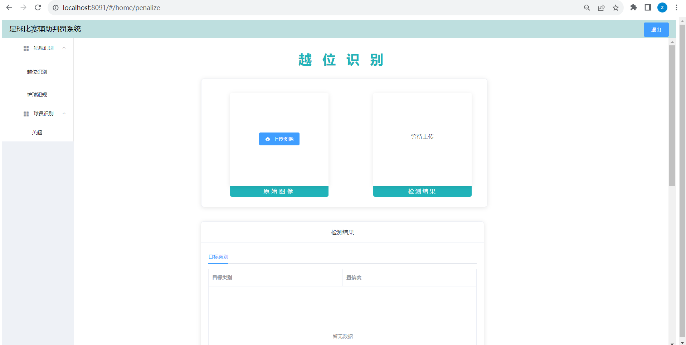

resouces以及weights文件太大，请先参考gitee同名项目

###运行
####后端运行
recongnition \
-test 
####前端运行 
终端 \
npm run serve \
运行app.py
#####前端兼容报错解决方案: 
set NODE_OPTIONS=--openssl-legacy-provider 
####文件信息
test为测试数据 \
   --offside为越位测试数据 \
   --slidetackle为铲球测试数据 \
   --faceData人脸识别测试数据 \
data为铲球识别的数据及权重文件 \
models为铲球识别模型 \
yolov5_utils为越位识别的文件 \
fall_utils为铲球识别的文件

###登陆界面

登陆页面背景视频取自skysport（天空体育） \
终端 npm run serve \
在地址后输入login即可进入登陆界面 \
登陆提示框设置为半透明度，点击可触发全显示 \
系统未设置登陆密码，验证规则为3-18长度字符即可登陆
###系统页面
####系统首页-越位识别界面

在左侧导航栏可以选择系统的不同功能（越位识别，铲球返回，英超（人脸识别）） \
人脸识别预训练模型包含五个曼城球员人脸数据（B席、哈兰德、德布劳内、阿尔瓦雷斯、马赫雷斯） \
系统界面参考自：[https://github.com/Sharpiless/Yolov5-Flask-VUE](https://github.com/Sharpiless/Yolov5-Flask-VUE) \
人脸识别功能实现参考自：[https://github.com/BlackFeatherQQ/FaceRecognition](https://github.com/BlackFeatherQQ/FaceRecognition) \
自己训练模型可以参考： [https://blog.csdn.net/weixin_55749226/article/details/128480595?spm=1001.2014.3001.5506](https://blog.csdn.net/weixin_55749226/article/details/128480595?spm=1001.2014.3001.5506) \
[https://blog.csdn.net/weixin_64524066/article/details/126845366?spm=1001.2014.3001.5506](https://blog.csdn.net/weixin_64524066/article/details/126845366?spm=1001.2014.3001.5506)

####环境
pip install -r requirements.txt

